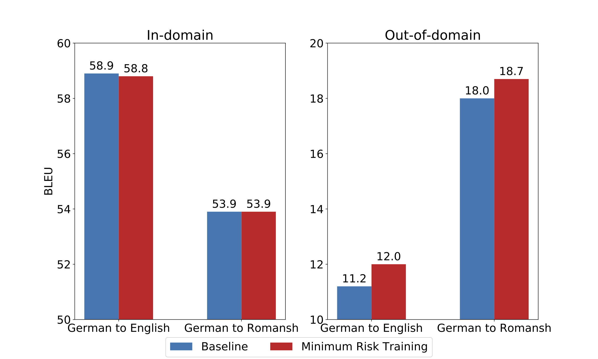
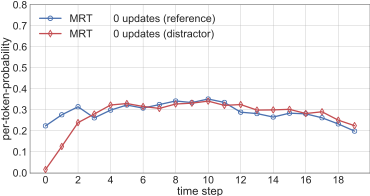
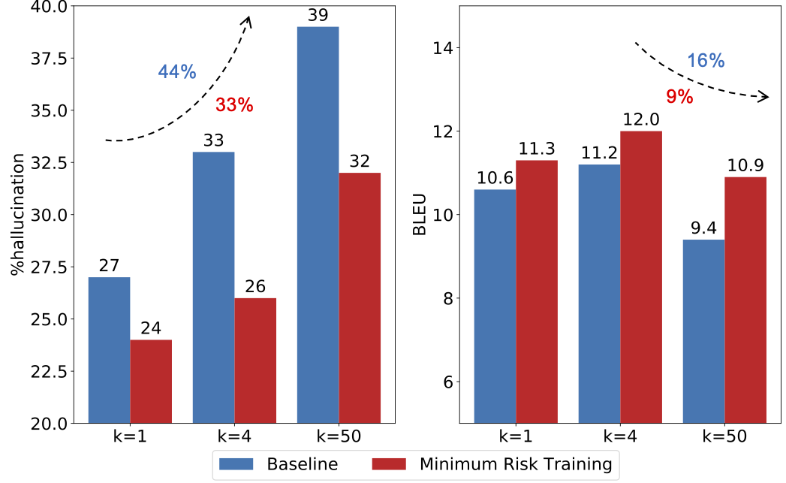

# On Exposure Bias, Hallucination and Domain Shift in Neural Machine Translation

A Brief introduction and training scripts of [On Exposure Bias, Hallucination and Domain Shift in Neural Machine Translation](https://arxiv.org/abs/2005.03642). The code has been merged into [Nematus](https://github.com/EdinburghNLP/nematus). The initial version of codes for the paper is in branch [`initial-version`](https://github.com/zippotju/Exposure-Bias-Hallucination-Domain-Shift/tree/initial-version).

## Introduction
### Background
First, what is halluciantion? It refers to the translation that are fluent but completely unrelated to the input. Take an example:

| Example |  |
|---        |---          |
| Source: | *Sie hat uns alle gefunden.* |
| Reference: | *She found all of us.* |
| Hypothesis: | *If their symptoms are the same as yours.* |

We feed the model this German sentence, which means "she found all of us" However, our model translates it as "if their symptoms are the same as yours". Previous studies and our study both found that hallucination is particularly common under out-of-domain translation. This is a problem in practice when the target domain is unknown, or in low-resource settings where there's no training data in the target domain. Therefore, we conduct the exploration of domain shift from the perspective of hallucination.

### Research Questions

There is a mismatch between training and inference in current NMT model, which is called exposure bias. Sequence-level training objectives such as MRT inherently avoid exposure bias. However, there is debate about the practical matters of exposure bias in the community.

In this paper, we conjecture that exposure bias would partially attribute to hallucination, therefore in this paper, we investigated: **first, is exposure bias to blame for hallucinations?** **second, can MRT to some extent solve hallucinations under domain shift?**

### Experiment Setup
We experiment over two language pairs, German to English (OPUS) and Germain to Romansh (Allegra/Convivenza). For German to English, we train the model with data from medical domain and test it on the mix of IT, law, koran and subtitles domain. For German to Romansh, training data comes from law but test data from blogs.

The baseline is trained with MLE training objective on the standard Transformer architecture. Then we fine-tune the baseline with MRT as the contrastive model.

### Results

The graph shows the BLEU score of models over two language pairs on in-domain and out-of-domain test sets. The blue bar represents baseline, and the red bar denotes the contrastive model. 

For in-domain (left chart), we can see that there is no difference between baseline and contrastive model on both language pairs. For out-of-domain (right chart), after MRT fine-tuning, there is an obvious improvement in BLEU , with the increase of 0.8-0.7 over two language pairs.

### Analysis: Hallucination (German to English)
We further manually evaluate the proportion of hallucinations in the test set, only on German to English for simplicity. We ask annotators to make two classification tasks. For adequacy, classify a translation as adequate, partial adequate or inadequate, and fluent, partial fluent, or not fluent for fluency. Then the translation which is annotated as fluent or partial fluent and adequate is seen as a hallucination.

| System | % hallucinations (BLEU) |
|---        |---          |
| Baseline | 33% (11.2) |
| +Minimum Risk Training | 26% (12.0) |
*Proportion of hallucinations and BLEU on out of-domain test sets.*

The results in above table demonstrate that with MRT training, the proportion of hallucination decreases from 33% to 26%, along with the increase in BLEU score.

### Analysis: Uncertainty (German to English)

Up to now, our experiments confirm that MRT can alleviate hallucination under domain shift and thereby improve domain robustness. Nevertheless, we are still not clear whether the improvements shown here result from the alleviation of exposure bias.

To better understand the link between exposure bias and hallucination, we visualise how MRT fine-tuning affects model bias towards hallucinations.

Specifically, we plot the per-token-probability of the model to the **reference**, and also to a random sampled sentence from the test set, with the same length of the reference. We call it **distractor**.

#### **out-of-domain**

The animation below shows the dynamic change of the model to distractor and reference with the MRT fine-tuning on out-of-domain test sets.

In the baseline (MRT 0 updates), the model fails to prefer the reference over a random distractor at later time steps, which can lead to some hallucination becoming the most probable overall.

However, MRT increases the gap between distractor and reference, especially after MRT 1000 updates. Therefore, less hallucinations are generated by the model.

Note, the increase in all probabilities with MRT (between MRT 0-500 updates) is because of label smoothing in the baseline. The general trend that baseline hallucinates and MRT helps is also true without label smoothing. Results are shown in the paper.

#### **in-domain**

Above shows the in-domain result . For in-domain, the pattern is similar with out-of-domain (for higher time steps of baseline, there is little difference between distractor and reference, and MRT increases the gap between them), but because difference is so big for earlier time steps, this is unlikely to affect globally best hypothesis. Therefore, rare hallucinations are produced on in-domain test set.

### Analysis: Beam Size (German to English)
Based on previous visualisation, we naturally link the beam size problem (increase beam size, performance drop) to hallucinations. From the baseline uncertainty analysis in the [section](#analysis:-uncertainty-(out-of-domain-german-to-english)), as shown in figure below, we can see that in the first few time steps, the reference tends to be more probable, so if a hallucination "survives" the first few time steps, then there's a risk that it will become the most likely hypothesis over time. Therefore, increasing beam size, more hallucination will be generated, and deteriorating performance.

We then verify the hypothesis by evaluating BLEU and hallucination with beam size of 1, 4 and 50. Results are shown in bar chart below. In the left plot, with higher beam size, hallucinations become more frequent. It increases 44% (relatively) from beam 1 to 50, but 33% after MRT. The BLEU score decreases from beam 4 to 50 in the right chart, but the drop rate reduces from 16% of baseline to 9% after MRT.

### Conclusion
Overall, our paper shows a new practical problem of exposure bias by drawing a link between exposure bias and hallucination under domain shift. More concretely, it confirms that MRT can reduce hallucination and correspondingly improve domain robustness. Moreover, we provide a new reason to use sequence-level training objectives such as MRT, even if they don't improve in-domain performance, they help the increase of domain robustness.

## Usage instruction
*Only respository-specific usage instruction, for general usages instruction, please refer to [Nematus](https://github.com/EdinburghNLP/nematus)*

#### `nematus/train.py` : use to train a new model

#### training parameters
| parameter | description |
|---        |---          |
| --loss_function {cross-entropy,per-token-cross-entropy, MRT} | loss function. MRT: Minimum Risk Training https://www.aclweb.org/anthology/P/P16/P16-1159.pdf) (default: cross-entropy) |
| --print_per_token_pro PATH | PATH to store the probability of each target token given source sentences over the training dataset (without training). If set to False, the function will not be triggered. (default: False). Please get rid of the 1.0s at the end of each list which are the probability of padding. |

#### minimum risk training parameters (MRT)

| parameter | description |
|---        |---          |
| --mrt_reference | add reference into MRT candidates sentences (default: False) |
| --mrt_alpha FLOAT | MRT alpha to control the sharpness of the distribution of sampled subspace (default: 0.005) |
| --samplesN INT | the number of sampled candidates sentences per source sentence (default: 100) |
| --mrt_loss | evaluation metrics used to compute loss between the candidate translation and reference translation (default: SENTENCEBLEU n=4) |
| --mrt_ml_mix FLOAT | mix in MLE objective in MRT training with this scaling factor (default: 0) |
| --sample_way {beam_search, randomly_sample} | the sampling strategy to generate candidates sentences (default: beam_search) |
| --max_len_a INT | generate candidates sentences with maximum length: ax + b, where x is the length of the source sentence (default: 1.5) |
| --max_len_b INT | generate candidates sentences with maximum length: ax + b, where x is the length of the source sentence (default: 5) |
| --max_sentences_of_sampling INT | maximum number of source sentences to generate candidates sentences at one time (limited by device memory capacity) (default: 0) |

Data dowload and preprocessing, please refer to https://github.com/ZurichNLP/domain-robustness

Please refer to https://github.com/EdinburghNLP/wmt17-transformer-scripts for training and evaluation process, the default training scripts of our experiments are [here](./scripts).

